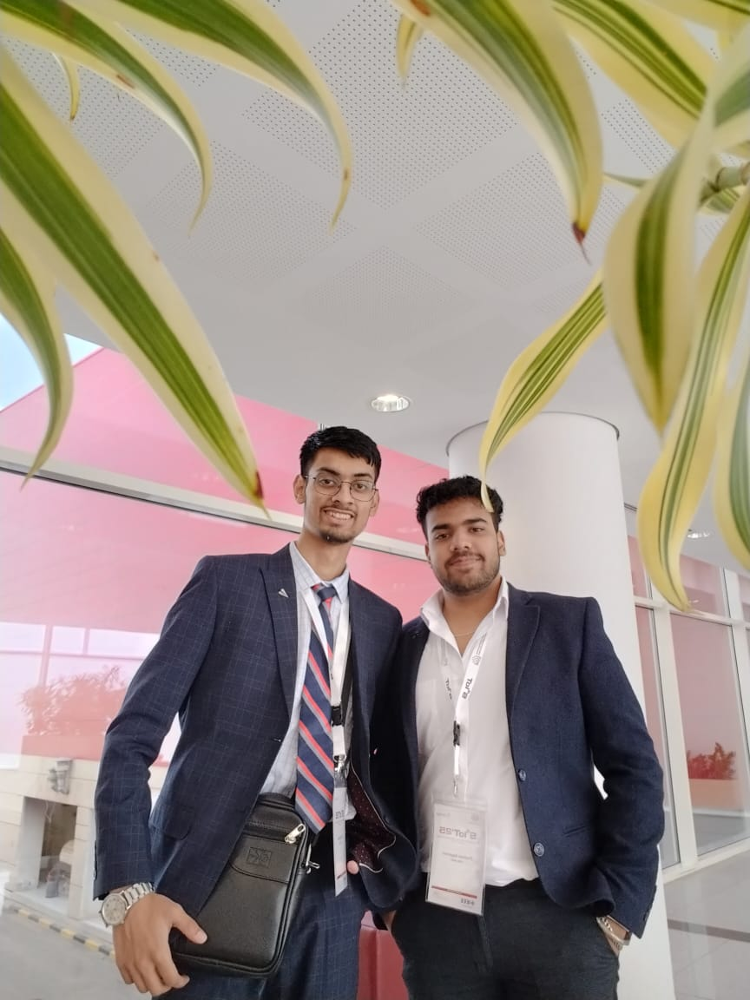
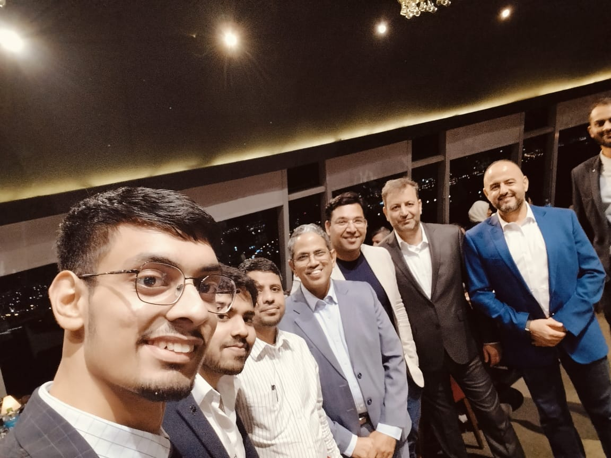
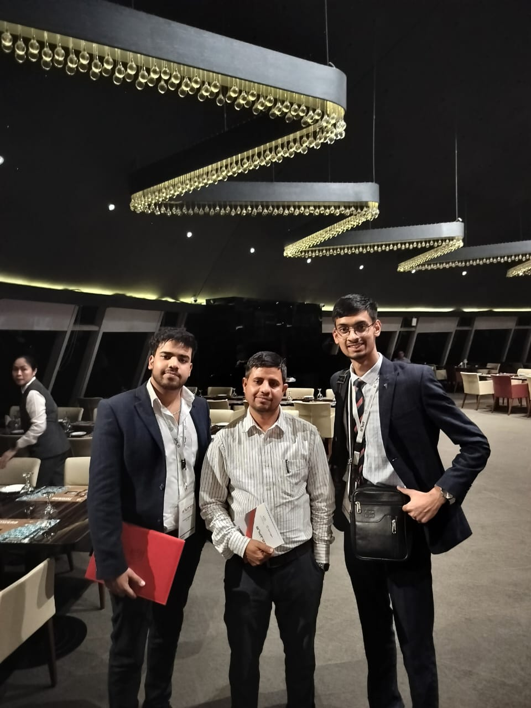
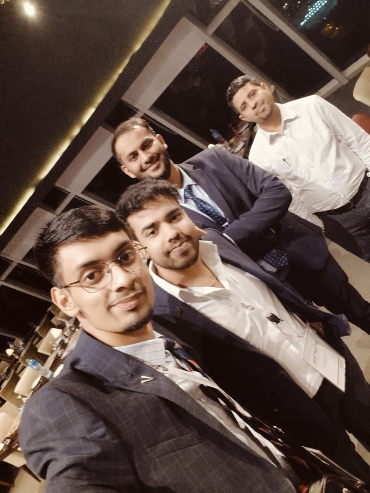
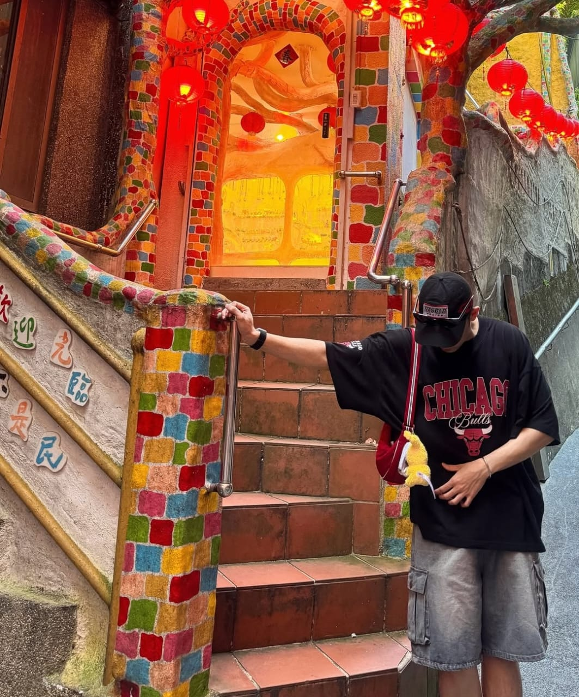
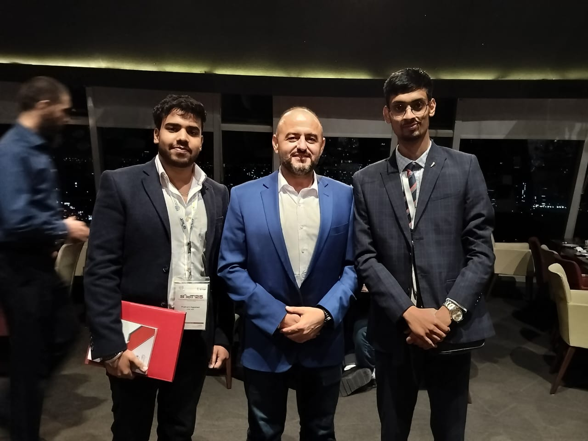
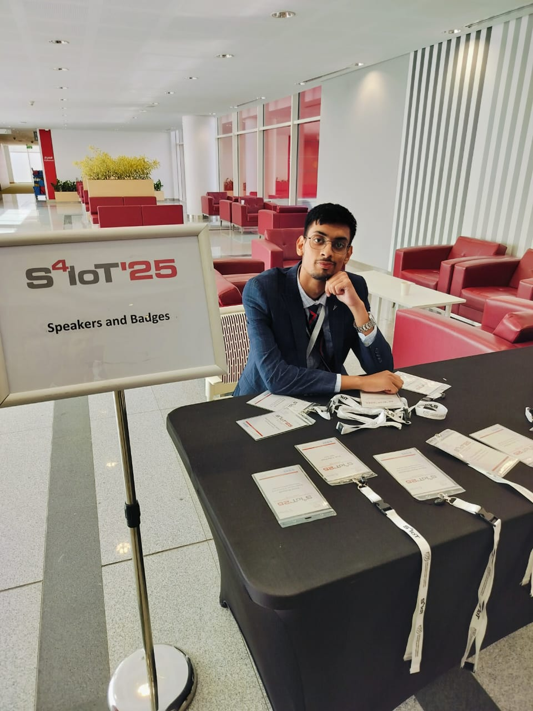

DRY-(Don't Repeat Yourself) (My Software Developer Journey)
<mark><h1 align="center">Hi 👋, I'm Dhruv Dhayal</h1></mark>

<h3 align="center">Upcoming Software Develouper Aboard! from INDIA 🇮🇳</h3>

  

  

✅ <b> Ex - Former Project Management Intern @Spotify | 🇸🇪  
✅ <b> Ex - Technical IoT Head & Core Member at @SDIC | 🇮🇳  
✅ <b> Young Acheiver Awardee @KCST S4IOT'25 | 🇰🇼  
✅ <b> Trust The Process, Busy In Creating The Beast  
✅ <b> Discord Community : <a href="https://discord.gg/Gj7PHdaR">@Become an Avengers</a>  
✅ <b> Research Scholar Partnership @CyberGeeks  

<h2 align="center" style="margin-bottom: 20px;">
  <strong>📬 How to Reach Me</strong>
</h2>
<table align="center">
  <tr>
    <td align="center" width="400">
      
    </td>
    <td align="left" valign="top">
      <table>
        <tr>
          <td align="center">😊</td>
          <td><strong>Email:</strong></td>
          <td><a href="mailto:dhayaldhruv271@gmail.com">dhayaldhruv271@gmail.com</a></td>
        </tr>
        <tr>
          <td align="center">📷</td>
          <td><strong>Instagram - </strong></td>
          <td><a href="https://www.instagram.com/dhayaldhruv271/?hl=en" target="_blank">@dhruvdhayal271</a></td>
        </tr>
        <tr>
          <td align="center">💼</td>
          <td><strong>LinkedIn - </strong></td>
          <td><a href="https://www.linkedin.com/in/your-linkedin-id](https://www.linkedin.com/in/dhruv-dhayal-9568b7262/" target="_blank">linkedin.com/in/your-linkedin-id</a></td>
        </tr>
        <tr>
          <td align="center">💻</td>
          <td><strong>GitHub - </strong></td>
          <td><a href="https://github.com/BlockNotes-4515" target="_blank">BlockNotes-4515</a></td>
        </tr>
        <tr>
          <td align="center">📀</td>
          <td><strong>Spotify - </strong></td>
          <td><a href="https://github.com/dhruvdhayal271](https://open.spotify.com/playlist/4Kj8u2FK0MCuLIQ1KO41eE?si=b6HQpPunQQ65lpzu8ID6uA&pi=7o-k0-nzS62bu" target="_blank">RELAXATION PT.1</a></td
        </tr>
       <tr>
          <td align="center">🌀</td>
          <td><strong>Discord - </strong></td>
          <td><a href="https://discord.gg/Gj7PHdaR" target="_blank">Dhruv Dhayal Server</a></td>
       </tr>
        <tr>
          <td align="center">🌀</td>
          <td><strong>ORCID - </strong></td>
          <td><a href="https://orcid.org/0009-0000-8346-7834" target="_blank">Research Scholars ID</a></td>
       </tr>
      </table>
    </td>
  </tr>
</table>

<h2 align="center">🙋‍♂️ <strong>About Myself</strong></h2>

👋 As a 'BCA.H' Student & currently serve as a coordinator in Software Development Cell, I have a passionate of deep interest in software development & Software Engineering. passionate and driven Computer Science student with a deep-rooted love for programming and technology. Aspiring to make a positive impact in the digital world, I am constantly seeking opportunities to expand my skill set and grow as a professional in the tech and Management.

☢️<h2><b>Education:</b></h2>
Currently pursuing Master's degree in Computer Science and Completed my Bachelor's in CSIT, DELHI (IITM, GGSIPU), I have been immersed in a dynamic and challenging curriculum that covers a wide range of topics such as data structures, algorithms, software engineering, and database management. My academic journey has not only honed my problem-solving abilities but also instilled in me a thirst for knowledge in this ever-evolving field.

☢️<h2><b>Technical Expertise:</b></h2>
I have a solid command over various programming languages, including:
<b>Python:</b> My go-to language for its simplicity and flexibility, enabling me to create efficient scripts and explore the realms of data analysis and machine learning.
 <b>C/C++:</b> A language I admire for its power and performance, which has helped me understand low-level concepts and develop efficient systems software.
 <b>HTML/CSS/JavaScript/PHP:</b> Proficient in Front-End & Back-End web technologies, I enjoy creating visually appealing and interactive web applications.
 <b>SQL:</b> With a firm grasp on database management, I can efficiently design and manipulate databases for various applications.

☢️<h2><b></b>Projects and Passion:</h2><b></h2>
Throughout my academic journey, I have actively engaged in personal projects, hackathons, and coding competitions. These experiences have not only bolstered my technical skills but also taught me the value of teamwork and creativity in finding innovative solutions to complex problems. I also done my Project in the Web-Develoupment, Python Programming(Hotel-Management), and in coming near future my projects will be Announce soon.

☢️<h2><b>Key Strengths:</b></h2>
Strong analytical skills with a detail-oriented approach to coding.
Effective communicator and team player, thriving in collaborative environments.
Keen on staying updated with the latest industry trends and best practices.

☢️<h2><b>Future Endeavors:</b></h2>
As I approach the next phase of my journey, I'm eager to contribute my skills and passion to a dynamic team where I can continue to grow as a software developer. I am open to internships, projects, or job opportunities that align with my interests and allow me to challenge myself while making a meaningful impact.
 

<h2 align="center">🏆🖼️ <strong>Gallery Media</strong></h2>
<table align="center">
  <tr>
    <td align="center"></td>
    <td align="center"></td>
    <td align="center"></td>
    <td align="center"></td>
    <td align="center"></td>
    <td align="center"></td>
    <td align="center"></td>
    <td align="center"></td>
  </tr>
  <tr>
    <td align="center"></td>
    <td align="center"></td>
    <td align="center"></td>
    <td align="center"></td>
    <td align="center"></td>
    <td align="center"></td>
    <td align="center"></td>
    <td align="center"></td>
  </tr>
  <tr>
    <td align="center" colspan="4">
      <td align="center"></td>
      <td align="center"></td>
      <td align="center"></td>
      <td align="center"></td>
    </td>
  </tr>
</table>

<!--

    

-->
<!--

  

-->

<h2 align="center">📞 Connect With Me..! 🤙 Let's Connect!</h2>

  

<h3 align="left">Languages and Tools:</h3>

 
    
   
     
    

<a href="https://share.streamlit.io/">
     
  

  

  

&nbsp;

    

 

     

  

  

<!--- ------------------------------------------------------------------------------------------------------------------------------------------------------ -->
<!--- -- 💜 Thanks For Visiting --------------------------------------------------------------------------------------------------------------------------- -->
<!--- ------------------------------------------------------------------------------------------------------------------------------------------------------ -->
<!--- -- Moving Logos -------------------------------------------------------------------------------------------------------------------------------------- -->
<!--- ------------------------------------------------------------------------------------------------------------------------------------------------------ -->

   ## Languages Used Updates As Per IST. DhruvDhayalCo. and Productions [🔝](#--gifs-for-readme--) 'DM' : For Collaborations (+91-8529994515)

  

  

      

##  Thanks for Visiting Fir Ayega Fir (Rajma Chawal Khane Chlenge Acha Chl Treat Meri Trf Se!) [🔝](#--gifs-for-readme--)

<h3 align="center">
  <strong>Made with 💜 by <a href="https://www.instagram.com/dhayaldhruv271/?hl=en" target="_blank">@dhruvdhayalCo.</a></strong>
</h3>

  <strong>
    Please 🌟 this repository! It really helps others to find this!! 
    Ok! DRY - "Don't Repeat Yourself"
    
  </strong>

 

  
  

 

  

